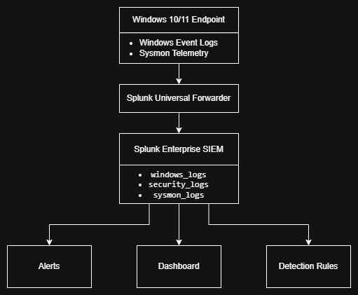
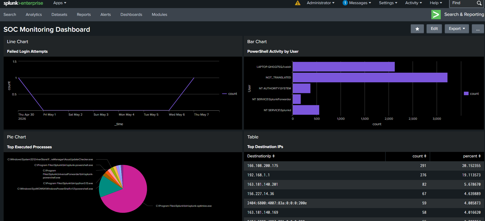
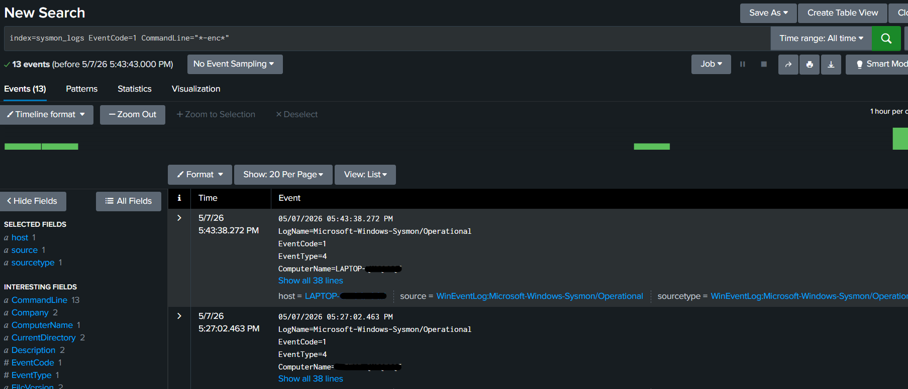
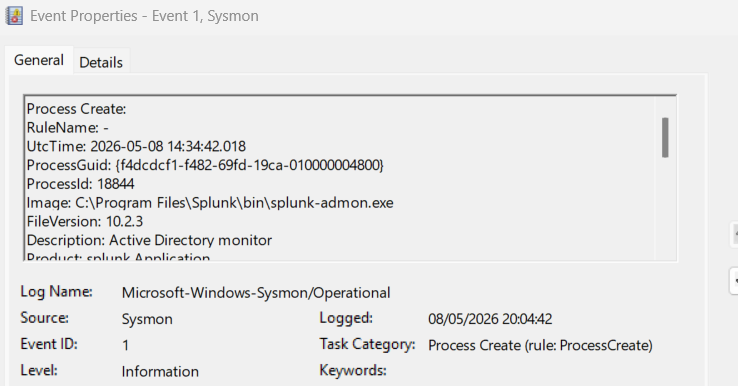

# SOC SIEM Lab using Splunk and Sysmon

## Project Overview

This project demonstrates the implementation of a Security Operations Center (SOC) home lab using Splunk Enterprise, Sysmon, and Windows Event Logs.

The lab was designed to simulate real-world SOC workflows including:

- Log ingestion
- Endpoint telemetry collection
- Detection engineering
- Alert creation
- Threat hunting
- Dashboard monitoring
- MITRE ATT&CK mapping

The environment collects Windows and Sysmon telemetry through Splunk Universal Forwarder and analyzes the data using SPL queries and SOC detections.

## Architecture Diagram

## Tools & Technologies

- Splunk Enterprise
- Splunk Universal Forwarder
- Sysmon
- Windows Event Logs
- SPL (Search Processing Language)
- MITRE ATT&CK Framework

## Data Sources

| Data Source | Description |
|---|---|
| Windows Security Logs | Authentication and login events |
| Windows System Logs | System-level events |
| Sysmon Event ID 1 | Process Creation |
| Sysmon Event ID 3 | Network Connections |

## Detection Rules

Implemented detections include:

- Encoded PowerShell Detection
- PowerShell Execution Monitoring
- Failed Login Detection
- Excessive Failed Login Detection
- Certutil LOLBin Detection
- Office Spawning PowerShell Detection
- Network Connection Monitoring

## MITRE ATT&CK Mapping

| Detection | Technique ID |
|---|---|
| Encoded PowerShell | T1059.001 |
| Failed Login Attempts | T1110 |
| Certutil Execution | T1218 |
| Network Connections | T1071 |

## SOC Dashboard Features

The Splunk dashboard includes:

- Failed login monitoring
- PowerShell activity visualization
- Top executed processes
- Outbound network connection tracking
- Security event distribution

## Key Learning Outcomes

Through this project I gained hands-on experience in:

- SIEM deployment and configuration
- Endpoint telemetry ingestion
- Detection engineering using SPL
- Sysmon configuration and monitoring
- Alert creation in Splunk
- Threat hunting workflows
- MITRE ATT&CK mapping
- Troubleshooting log ingestion and permission issues

## Future Improvements

Planned future enhancements include:

- Advanced threat simulations
- Additional Sysmon detections
- Sigma rule integration
- Threat intelligence enrichment
- Automated alert actions
- Multi-endpoint log collection

## Screenshots

## Dashboard Preview

## Detection Example

## Sysmon Telemtery Example

